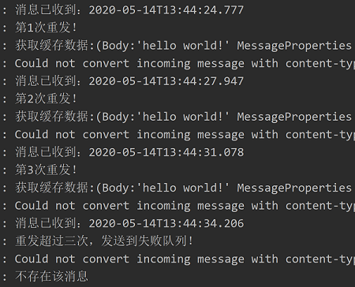

# 一、Spring Boot整合RabbitMQ介绍

&emsp;&emsp;Spring Boot整合RabbitMQ，具体实现思路和细节请参考:

> [Spring Boot整合RabbitMQ](https://www.jianshu.com/p/8db16f5fe3c7)

- RabbitMQ简易使用
- 实现消息确认机制(ACK)
- 基于延迟队列 & 死信队列实现消息延迟发送、消息重发
- 基于Redis解决RabbitMQ消息幂等性问题

# 二、前期准备

## 2.1 MySQL数据库准备:

- 对应的SQL见 /src/main/resources/sql/CreateTableSQL.sql
- 创建数据库TestDataBase
- 建表 - student(学生)
- MySQL配置信息见 /src/main/resources/application.yaml

## 2.2 Redis数据库准备:

- Redis配置信息见 /src/main/resources/application.yaml

## 2.3 RabbitMQ准备:

- RabbitMQ配置信息见 /src/main/resources/application.yaml

## 2.4 PostMan测试工具准备:

- [下载地址](https://www.postman.com/)

# 三、测试信息

&emsp;&emsp;请求测试：

&emsp;&emsp;测试结果：

